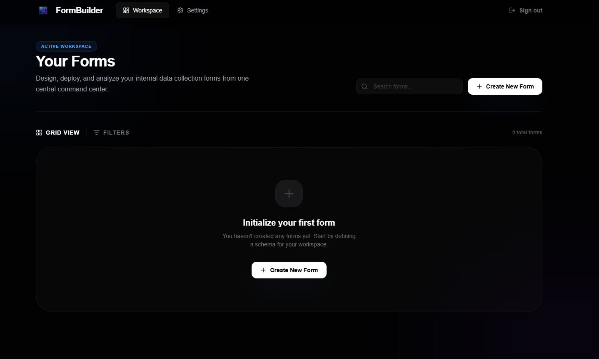

# Protocol



**Live Demo**: [protocolforms.netlify.app](https://protocolforms.netlify.app)

A high-fidelity, infrastructure-grade system for designing, deploying, and analyzing data intake modules. Built for speed, security, and developer productivity.

## Architecture

Protocol transforms form creation into a technical workflow. It leverages a physics-based drag-and-drop engine and a robust server-side validation layer to ensure data integrity from entry to storage.

- **Infrastructure Core**: Built with Next.js 15 (App Router) and TypeScript.
- **Secure Persistence**: PostgreSQL backbone managed via Prisma ORM.
- **Identity & Access**: Secure authentication and Row Level Security (RLS) via Supabase.
- **Validation Engine**: Dynamic schema generation using Zod for real-time validation.
- **Tactile Interface**: Physics-based drag-and-drop modules for building complex schemas.

## Core Workflows

### The Builder
The "Infrastructure" tab provides a tactile workspace where you can drag and drop modules—Short Text, Email, Numbers, Choice Groups—to build your data protocol. Each module supports strict validation (Lock mode) or open intake.

### Real-Time Transmissions
The "Responses" tab provides a live stream of incoming data logs. Submissions are parsed into immutable entries, allowing you to monitor your active deployments in real-time.

### Logic & Themes
Customize the visual signature of your forms and define behavioral rules. Each form is assigned a unique URL slug for instant public distribution.

## Tech Stack

- **Framework**: `Next.js 15` (Turbopack)
- **Database**: `PostgreSQL` + `Supabase`
- **ORM**: `Prisma`
- **Styling**: `Tailwind CSS` + `Lucide Icons`
- **Interaction**: `@dnd-kit` (Physics Engine)
- **Validation**: `Zod`

## Deployment Checklist

1. **Environment Initialization**:
   Ensure your `.env` contains valid Supabase and Prisma connection strings.
   ```env
   NEXT_PUBLIC_SUPABASE_URL=
   NEXT_PUBLIC_SUPABASE_ANON_KEY=
   DATABASE_URL=
   DIRECT_URL=
   ```

2. **Schema Synchronization**:
   Deploy the PostgreSQL schema and generate the client.
   ```bash
   npx prisma db push
   npx prisma generate
   ```

3. **Production Build**:
   Execute the optimized compile.
   ```bash
   npm run build
   ```

## Local Development

```bash
# Clone and install
git clone https://github.com/HuddyLatimer/FormBuilder
cd web
npm install

# Initialize local environment
npx prisma generate
npm run dev
```

---
*Optimized for professional data architects. 2026 Protocol Ready.*
